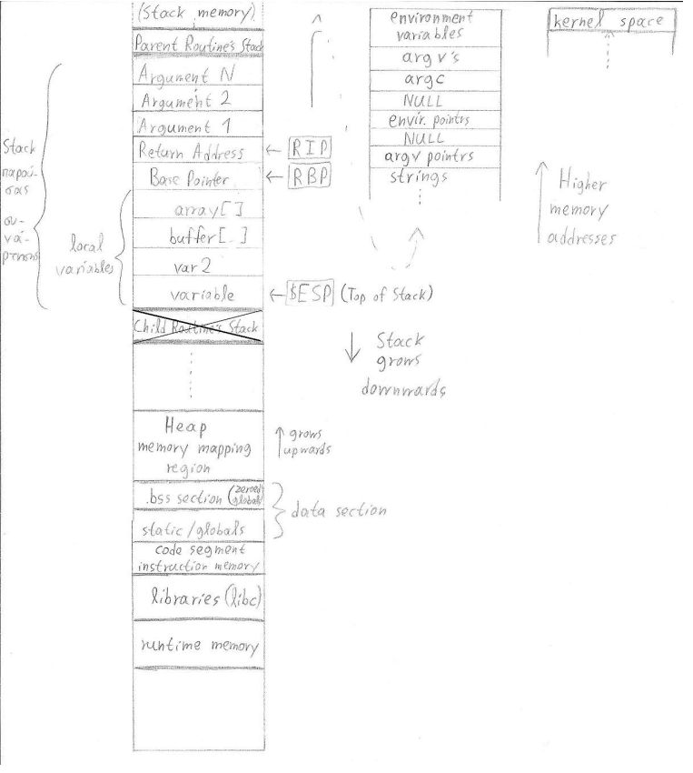

<h1 align="center">
	<a href="https://github.com/KeyC0de/BufferOverflow">Buffer Overflow</a>
</h1>
<hr>

There is full explanation and code in Greek only at the moment in "Nikos\_Lazaridis\_M1485\_Project#2\_ΥΣ13_ΕΑΡΙΝΟ_2017.pdf".
I may be motivated to translate this in the near future in English, especially If I get enough requests for it.

*!* During Buffer Overflow:</br>
The ultimate goal of a Buffer overflow attack is replacing the return address of the vulnerable function with another one of our choosing. The latter function will have ASCII shellcode placed into it which, when executed will change the normal behavior of the program in a way that the attacker sees fit; the sky's the limit here (more like the imagination of the attacker). That moment where a single byte is written in the return address, in which the RIP register points to that is when "Buffer Overflow" occurs (at least in our context). The Instruction Pointer (IP) jumps to a new memory address from which it will continue execution.

Complete memory layout of a program:

<p style="text-align: center;">
	
</p>

*!* What happens when a function in called in C?
A new stack frame has to be created. A stack frame is the memory address range between $ebp and $esp.
The sequence of instructions in the stack frame correspond to the operations function.

function A:
	- push function arguments
	- push space for the return value
	- push return address
	- push fp		; push the frame pointer
	- mov fp, sp	; store the stack pointer in the frame pointer
	- allocate space for locals. Now sp is decremented by one word per local variable
	(jump to the function B)
function B:
	- push space for the return value
	- push the address of the previous stack frame
	- push values of registers that this function uses (so they can be restored)
	- push space for local variables
		do the necessary computation
	- restore the registers
	- restore the previous stack frame
	- store the function result
	- jump to the return address
function A:
	- load the original stack pointer value which rests in the frame pointer
	- pop the old frame pointer
	- pop the return address
	- pop the return value

- Branching utilize PC-relative addressing.
- Jumps utilize absolute (απόλυτη ή ψευδοάμεση) addressing.

Stack Pointer control for inserting, removing values from a register:

```
addi $sp, $sp, -4			; Subtract $sp by 4.
sw $s0, 0($sp)			; Insert value of register to stack (say $t0)
lw $s0, ($sp) 			; Remove value from the stack and place to the register
addi $sp, $sp, 4			; add $sp by 4. Repeat these four steps for any local variables you want to extract from the stack.
```


## ShellCode, ASCII codes

Hex code	| x86 Instruction
------------|---------------------
\x90		| nop
\x40		| inc
\x66		| change operand size
\xe9		| jmp
\xe8		| call


# Contribute

This is distributed solely for educational purposes.

If somebody wants access to shellcodes and source zipped files send me a message and I'll send them to you. I have them zipped up with a password otherwise they will be tagged as viruses and deleted (and my account may become flagged).

Please submit any bugs you find through GitHub repository 'Issues' page with details describing how to replicate the problem. If you liked it or you learned something new give it a star, clone it, contribute to it whatever. Enjoy.


# License

Distributed under the GNU GPL V3 License. See "GNU GPL license.txt" for more information.


# Contact

email: *nik.lazkey@gmail.com*</br>
website: *www.keyc0de.net*


# Acknowledgements

[Smashing The Stack For Fun And Profit](https://inst.eecs.berkeley.edu/~cs161/fa08/papers/stack_smashing.pdf)</br>
[Phrack Magazine - Buffer Overflows](http://phrack.org/issues/49/14.html)
